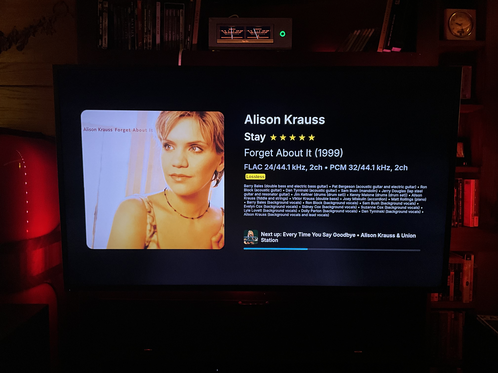

⸻
# moOde “Now Playing”

A distributed, high-performance **Now Playing** display system for **moOde Audio Player**, designed for a dedicated full-screen 1080p display — but viewable from **any device on your network**. (Could use some help creating various `@media` views). Display will show track personnel and 5-star ratings (if you have in your metadata/moOde sql).

This project intentionally separates:

- **Audio playback**
- **Metadata processing**
- **UI rendering**
- **(Optionally) Alexa skill so you can create a queue in moOde and hear on Echo devices**

across multiple Raspberry Pi nodes for **stability, performance, and flexibility**.

---

## One-Line Mental Model

- Web Host Pi **Port 3000 = data** (JSON, logic, metadata, art generation)
- Web Host Pi **Port 8000 = pixels** (HTML / JS only)

> The display never talks directly to moOde.  
> It only talks to the API node.

---

System Architecture (Three Pis)
```
┌────────────────────────┐
│ Pi #1 — moOde Player   │
│ (Audio playback)       │
│                        │
│ - MPD / moOde          │
│ - Music storage        │
│ - /command API         │
│ - aplmeta.txt (AirPlay)│
└─────────┬──────────────┘
│ HTTP (JSON)
▼
┌────────────────────────┐
│ Pi #2 — API + Web Host │
│ (Logic + Metadata)     │
│                        │
│ - moode-nowplaying-api │  ← Port 3000
│ - Artwork processing   │
│ - Metadata caching     │
│ - Static web server    │  ← Port 8000
└─────────┬──────────────┘
│ HTTP (HTML/JS)
▼
┌────────────────────────┐
│ Pi #3 — Display Node   │
│ (TV / Monitor)         │
│                        │
│ - Chromium kiosk       │
│ - index1080.html       │
│ - script1080.js        │
└────────────────────────┘
```
---

## Roles of Each Raspberry Pi

### Pi #1 — moOde Player (Audio Only)

- Runs moOde Audio Player
- Handles all audio playback
- Hosts the music library
- Exposes:
  - `/command/?cmd=get_currentsong`
  - `/command/?cmd=status`
  - `/var/local/www/aplmeta.txt` (AirPlay metadata + cover output)

This Pi runs no custom code for this project.  
It just moOdes.

If Pi #2 needs file access, use USB, Samba, or NFS.

---

### Pi #2 — API + Web Server (The Brains)

This is where all logic lives.

**Responsibilities:**

- Query moOde for playback state
- Read deep metadata from local audio files
- Normalize output for:
  - Local files
  - Radio streams
  - UPnP
  - AirPlay
- Resolve and cache album artwork
- Serve:
  - JSON API → Port 3000
  - Static UI → Port 8000
  - (Optionally) act as the Alexa integration endpoint

**Key components:**

- `moode-nowplaying-api.mjs` (Node / Express)
- `metaflac`
- Static web server

---

## API Surface (Pi #2)

Pi #2 exposes a small, intentionally constrained HTTP API.

Consumed by:

- The web UI (polling + artwork)
- Optional Alexa Skill (playback + synchronization)
- Optional external clients

Example JSON output while a track is playing on moOde:
```
{"artist":"Alison Krauss","title":"I Give You to His Heart","album":"A Hundred Miles or More: A Collection","file":"USB/SamsungMoode/Ondesoft/A Hundred Miles or More A Collection/AlisonKrauss-AHundredMilesorMoreACollection-13-IGiveYoutoHisHeart.flac","songpos":"23","songid":"54650","albumArtUrl":"http://10.0.0.254/coverart.php/USB%2FSamsungMoode%2FOndesoft%2FA%20Hundred%20Miles%20or%20More%20A%20Collection%2FAlisonKrauss-AHundredMilesorMoreACollection-13-IGiveYoutoHisHeart.flac","aplArtUrl":"https://moode.brianwis.com/art/current_320.jpg","altArtUrl":"","radioAlbum":"","radioYear":"","radioLabel":"","radioComposer":"","radioWork":"","radioPerformers":"","state":"play","elapsed":177,"duration":269,"percent":66,"year":"2007","label":"New Rounder","producer":"","personnel":["Alison Krauss (lead vocals)"],"encoded":"FLAC 24/44.1 kHz, 2ch","bitrate":"1.472 Mbps","outrate":"PCM 32/44.1 kHz, 2ch","volume":"0","mute":"0","track":"13","date":"200704","isStream":false,"isAirplay":false,"streamKind":"","isUpnp":false,"isFavorite":false}
```
This JSON provides everything needed for the webserver and Alexa skill to function.

### Public (No Authentication)

| Method | Endpoint | Purpose |
|------|---------|---------|
| GET | `/now-playing` | Current track's data |
| GET | `/next-up` | Teaser for browser |
| GET | `/art/current_320.jpg` | Current track artwork |
| GET | `/art/current_bg_640_blur.jpg` | Blurred background artwork |

---

### Key-Protected (Alexa / Control)

| Method | Endpoint | Purpose |
|------|---------|---------|
| GET | `/track?file=&k=&t=` | HTTPS audio stream for Alexa |
| POST | `/queue/advance?k=&pos0=` | Advance MPD queue |
| POST | `/rating/current` | Set rating (local files only) |
| POST | `/favorites/toggle` | Toggle favorite |

> Treat the API key as a password.  
> Never commit it to GitHub.

---

### Pi #3 — Display / Kiosk (Optional)

- Connected to a TV or monitor
- Runs Chromium in kiosk mode
- Loads the UI from Pi #2:

http://<PI2_IP>:8000/index1080.html

No metadata logic.  
No audio.  
No local files.

You can skip Pi #3 entirely and view the display from any browser.

---

## Playback Modes & Behavior

| Mode    | Artwork Quality | Ratings | Progress | Notes |
|--------|-----------------|---------|----------|-------|
| Local  | Strongest       | ✅ Yes  | ✅ Yes   | Deep metadata + MPD stickers |
| Radio  | Strong          | Hidden  | Hidden   | iTunes art, album/year text |
| UPnP   | Moderate        | Hidden  | Hidden   | Treated as stream |
| AirPlay| Strong          | Hidden  | Hidden   | LAN art + HTTPS fallback |

In all modes, the UI strives for consistent metadata presentation.

---

## Primary Project Files

| File | Runs On | Purpose |
|-----|--------|---------|
| `moode-nowplaying-api.mjs` | Pi #2 | Aggregates playback + metadata |
| `index1080.html` | Pi #2 | Fullscreen 1080p UI |
| `script1080.js` | Pi #2 | UI logic, polling, animation |
| `images/*.png` | Pi #2 | Mode icons / fallback art |

---
Other necessary files are included in directories.

## Networking Requirements

- All Pis must be on the same LAN
- If Alexa is enabled:
  - Pi #2 must be reachable via HTTPS
  - Use a public domain or secure tunnel

---

## MPD Stickers (Required for Ratings)

Ratings use MPD stickers, **not file tags**.

- Apply only to local files
- Never modify audio files
- Automatically hidden for Radio / UPnP / AirPlay

Required MPD config:

sticker_file “/var/lib/mpd/sticker.sql”

---

## Optional: Alexa Skill Integration

Alexa never talks directly to moOde.  
All coordination flows through Pi #2.

Benefits:

- MPD remains authoritative
- Alexa stays stateless
- Queue alignment is preserved
- Artwork + metadata stay consistent

---

## Common Pitfalls

- Don’t open `index1080.html` via `file://`
- Don’t serve the UI from port 3000
- Don’t point the UI directly at moOde
- Don’t expect ratings on streams

---




⸻
