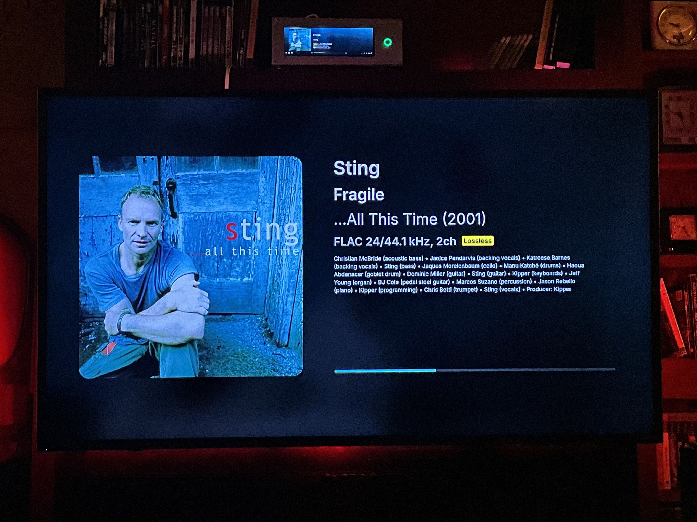

MoOde "Now Playing"

A distributed, high-performance "What’s Playing" display system for moOde Audio Player, designed for a dedicated full-screen 1080p display (or view on your computer/device) and optimized for Raspberry Pi hardware.

This project intentionally separates audio playback, metadata processing, and display rendering across three Raspberry Pi devices for stability, performance, and flexibility.

⸻

System Architecture (Three Pis)
```
┌────────────────────────┐
│ Pi #1 -- moOde Player   │
│ (Audio playback)       │
│                        │
│ • MPD / moOde          │
│ • Music storage        │
│ • /command API         │
└─────────┬──────────────┘
          │ HTTP (JSON)
          ▼
┌────────────────────────┐
│ Pi #2 -- API + Web Host │
│ (Logic + Metadata)     │
│                        │
│ • server.mjs (Node)    │  ← Port 3000
│ • metaflac             │
│ • Metadata caching     │
│ • Web server           │  ← Port 8000
└─────────┬──────────────┘
          │ HTTP (HTML/JS)
          ▼
┌────────────────────────┐
│ Pi #3 -- Display Node   │
│ (TV / Monitor)         │
│                        │
│ • Chromium kiosk       │
│ • index1080.html       │
│ • script1080.js        │
└────────────────────────┘
```

⸻

Roles of Each Raspberry Pi

Pi #1 -- moOde Player
	•	Runs moOde Audio Player
	•	Handles all audio playback
	•	Hosts the music library
	•	Exposes moOde’s API:
	•	/command/?cmd=get_currentsong
	•	/command/?cmd=status
	•	/aplmeta.txt (AirPlay)

This Pi does not run any custom code for this project, it just "moOdes." Remember to set up samba for music file acces from the other pi.

⸻

Pi #2 -- API + Web Server

This is the brains of the system.

Responsibilities:
	•	Queries Pi #1 (moOde) for playback status
	•	Reads deep metadata directly from music files
	•	Normalizes output for:
	•	Local files
	•	Radio streams
	•	AirPlay
	•	Caches metadata and artwork for performance
	•	Serves both:
	•	JSON API (port 3000)
	•	Web UI files (port 8000)

Key components on Pi #2:
	•	server.mjs (Node.js / Express)
	•	metaflac
	•	Simple static web server

⸻

Pi #3 -- Display / Kiosk
	•	Connected to a TV or monitor
	•	Runs Chromium in kiosk mode
	•	Loads the display page from Pi #2:

http://<PI2_IP>:8000/index1080.html


	•	No metadata logic
	•	No audio
	•	No local storage required
	
	Skip this and just use your computer to see now playing.

⸻

Project Files

File	Location	Purpose
server.mjs	Pi #2	Aggregates moOde data + metadata
index1080.html	Pi #2	1080p fullscreen UI
script1080.js	Pi #2	UI logic, progress bar, caching
airplay.png	Pi #2	Fallback artwork for AirPlay


⸻

Networking Requirements

All three Pis must be on the same LAN.


Pi #2 Setup (API + Web Server)

Install dependencies

sudo apt update
sudo apt install -y nodejs npm flac

Verify:

node --version
metaflac --version


⸻

Music Library Access (IMPORTANT)

Pi #2 must have read access to the same music files used by moOde.

Common approaches:
	•	USB drive attached to Pi #2
	•	Samba / NFS mount from Pi #1

server.mjs assumes:

MOODE_USB_PREFIX = 'USB/YOURMUSICDRIVE/'
PI4_MOUNT_BASE  = '/mnt/YOURMUSICDRIVE'

These must match how moOde reports file paths.

⸻

Start the API server (Port 3000)

Edit server.mjs:

const MOODE_BASE_URL = 'http://<PI1_MOODE_IP>';
const LOCAL_ADDRESS = '<PI2_IP>';

Run:

node server.mjs

Or use PM2:

npm install -g pm2
pm2 start server.mjs --name moode-now-playing
pm2 save

Test:

curl http://<PI2_IP>:3000/now-playing | jq

Example of json returned:

{"artist":"Sting","title":"Fragile","album":"...All This Time","file":"USB/SamsungMoode/Ondesoft/All This Time (Live)/Sting-AllThisTime-1-Fragile.flac","albumArtUrl":"http://10.0.0.254/coverart.php/USB%2FSamsungMoode%2FOndesoft%2FAll%20This%20Time%20%28Live%29%2FSting-AllThisTime-1-Fragile.flac","altArtUrl":"","radioAlbum":"","radioYear":"","radioLabel":"","radioComposer":"","radioWork":"","radioPerformers":"","state":"play","elapsed":4.357,"duration":275.922,"percent":2,"year":"2001","label":"A&M Records","producer":"Kipper","personnel":["Christian McBride (acoustic bass)","Janice Pendarvis (backing vocals)","Katreese Barnes (backing vocals)","Sting (bass)","Jaques Morelenbaum (cello)","Manu Katché (drums)","Haoua Abdenacer (goblet drum)","Dominic Miller (guitar)","Sting (guitar)","Kipper (keyboards)","Jeff Young (organ)","BJ Cole (pedal steel guitar)","Marcos Suzano (percussion)","Jason Rebello (piano)","Kipper (programming)","Chris Botti (trumpet)","Sting (vocals)"],"encoded":"FLAC 24/44.1 kHz, 2ch","bitrate":"1.206 Mbps","outrate":"PCM 32/44.1 kHz, 2ch","volume":"0","mute":"0","track":"1","date":"200100","isStream":false,"isAirplay":false}

This is how we build the web page.


⸻

Start the Web Server (Port 8000)

From the directory containing index1080.html:

python3 -m http.server 8000


⸻

Pi #3 Setup (Display Node)

Launch Chromium in kiosk mode

chromium \
  --kiosk \
  --disable-infobars \
  --noerrdialogs \
  --disable-session-crashed-bubble \
  http://<PI2_IP>:8000/index1080.html

Hide mouse cursor

unclutter -idle 0 &


⸻

What the API Provides

GET /now-playing returns a fully merged object containing:
	•	Artist / title / album
	•	Album artwork (cached)
	•	Playback state
	•	Elapsed time & duration
	•	Progress percentage
	•	Personnel (PERFORMER)
	•	Producer (PRODUCER)
	•	Year (with robust fallback logic)
	•	Stream / AirPlay detection
	•   Performs iTunes public API lookup for radio tracks, grabs art

The UI never talks directly to moOde -- it only talks to Pi #2.

⸻

Why Three Pis?

Stability
	•	Audio playback is isolated from UI crashes

Performance
	•	No heavy JS or Chromium on the moOde Pi

Flexibility
	•	Display node can reboot independently
	•	UI can be redesigned without touching playback

Silence
	•	No unnecessary services on the audio Pi

⸻

Summary

✔ Three-Pi distributed architecture
✔ moOde untouched and stable
✔ Metadata handled once, cached intelligently
✔ Display is lightweight and disposable
✔ Designed for always-on use



